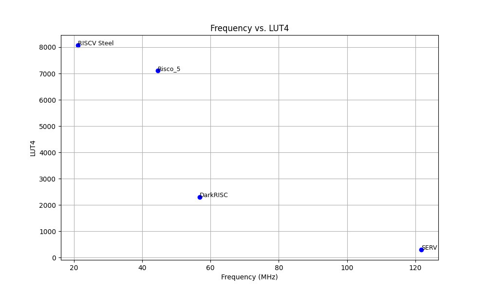

# Processos de Build Atualmente Suportados:

**Nota**: A infraestrutura ainda está em fase de implementação, alguns processadores podem estar em estado de erro devido a problemas na configuração da infraestrutura.

| Name | Links | Extensions | XLEN | Language | Status | Full Log |
| ---- | ------ | ---------- | ---- | -------- | ------ | -------- |
| RVX | [Github](https://github.com/rafaelcalcada/rvx) | I | 32 | Verilog |  | [Log](https://processorci.ic.unicamp.br/jenkins/blue/organizations/jenkins/rvx/activity) |
| Minerva | [Github](https://github.com/minerva-cpu/minerva) |  |  | Amaranth HDL(Python) |  | [Log](https://processorci.ic.unicamp.br/jenkins/blue/organizations/jenkins/minerva/activity) |
| mriscv | [Github](https://github.com/onchipuis/mriscv) |  | 32 | Verilog |  | [Log](https://processorci.ic.unicamp.br/jenkins/blue/organizations/jenkins/mriscv/activity) |
| e200_opensource | [Github](https://github.com/SI-RISCV/e200_opensource) |  |  | Verilog |  | [Log](https://processorci.ic.unicamp.br/jenkins/blue/organizations/jenkins/e200_opensource/activity) |
| serv | [Github](https://github.com/olofk/serv) | I[M] | 32 | Verilog |  | [Log](https://processorci.ic.unicamp.br/jenkins/blue/organizations/jenkins/serv/activity) |
| biriscv | [Github](https://github.com/ultraembedded/biriscv) |  | 32 | Verilog |  | [Log](https://processorci.ic.unicamp.br/jenkins/blue/organizations/jenkins/biriscv/activity) |
| picorv32 | [Github](https://github.com/YosysHQ/picorv32) |  | 32 | Verilog |  | [Log](https://processorci.ic.unicamp.br/jenkins/blue/organizations/jenkins/picorv32/activity) |
| DarkRISCV | [Github](https://github.com/darklife/darkriscv) | E/I | 32 | Verilog |  | [Log](https://processorci.ic.unicamp.br/jenkins/blue/organizations/jenkins/darkriscv/activity) |
| Tinyriscv | [Github](https://github.com/liangkangnan/tinyriscv) | IM | 32 | Verilog |  | [Log](https://processorci.ic.unicamp.br/jenkins/blue/organizations/jenkins/tinyriscv/activity) |
| Auk-V | [Github](https://github.com/veeYceeY/AUK-V-Aethia) |  | 32 | Verilog |  | [Log](https://processorci.ic.unicamp.br/jenkins/blue/organizations/jenkins/AUK-V-Aethia/activity) |
| DV-CPU-RV | [Github](https://github.com/devindang/dv-cpu-rv) |  | 32 | Verilog |  | [Log](https://processorci.ic.unicamp.br/jenkins/blue/organizations/jenkins/dv-cpu-rv/activity) |
| NeoRV32-Verilog | [Github](https://github.com/stnolting/neorv32-verilog) |  | 32 | Verilog |  | [Log](https://processorci.ic.unicamp.br/jenkins/blue/organizations/jenkins/neorv32-verilog/activity) |
| NeoRV32 | [Github](https://github.com/stnolting/neorv32) |  | 32 | VHDL |  | [Log](https://processorci.ic.unicamp.br/jenkins/blue/organizations/jenkins/neorv32/activity) |
| Tethorax | [Github](https://github.com/NikosDelijohn/Tethorax) |  |  | VHDL |  | [Log](https://processorci.ic.unicamp.br/jenkins/blue/organizations/jenkins/Tethorax/activity) |
| Baby Risco 5 | [Github](https://github.com/JN513/Baby-Risco-5) | E | 32 | Verilog |  | [Log](https://processorci.ic.unicamp.br/jenkins/blue/organizations/jenkins/Baby-Risco-5/activity) |
| Pequeno Risco 5 | [Github](https://github.com/JN513/Pequeno-Risco-5) | I | 32 | Verilog |  | [Log](https://processorci.ic.unicamp.br/jenkins/blue/organizations/jenkins/Pequeno-Risco-5/activity) |
| Risco 5 | [Github](https://github.com/JN513/Risco-5) | IM | 32 | Verilog |  | [Log](https://processorci.ic.unicamp.br/jenkins/blue/organizations/jenkins/Risco-5/activity) |
| Grande Risco 5 | [Github](https://github.com/JN513/Grande-Risco-5/) | IMBC_Zicsr | 32 | SystemVerilog |  | [Log](https://processorci.ic.unicamp.br/jenkins/blue/organizations/jenkins/Grande-Risco-5/activity) |
| Nerv | [Github](https://github.com/YosysHQ/nerv) | I | 32 | SystemVerilog |  | [Log](https://processorci.ic.unicamp.br/jenkins/blue/organizations/jenkins/nerv/activity) |
| CV32e40p | [Github](https://github.com/openhwgroup/cv32e40p) |  | 32 | SystemVerilog |  | [Log](https://processorci.ic.unicamp.br/jenkins/blue/organizations/jenkins/cv32e40p/activity) |
| Ibex (formerly Zero-riscy) | [Github](https://github.com/lowRISC/ibex) | EC IMC[B] |  | SystemVerilog |  | [Log](https://processorci.ic.unicamp.br/jenkins/blue/organizations/jenkins/ibex/activity) |
| CVA6 | [Github](https://github.com/openhwgroup/cva6) |  |  | SystemVerilog |  | [Log](https://processorci.ic.unicamp.br/jenkins/blue/organizations/jenkins/cva6/activity) |
| Roa Logic RV12 | [Github](https://github.com/roalogic/RV12) | I | 32 | SystemVerilog |  | [Log](https://processorci.ic.unicamp.br/jenkins/blue/organizations/jenkins/RV12/activity) |
| SCR1 | [Github](https://github.com/syntacore/scr1) |  |  | SystemVerilog |  | [Log](https://processorci.ic.unicamp.br/jenkins/blue/organizations/jenkins/scr1/activity) |
| ReonV | [Github](https://github.com/lcbcFoo/ReonV) |  | 32 | VHDL |  | [Log](https://processorci.ic.unicamp.br/jenkins/blue/organizations/jenkins/ReonV/activity) |
| SweRV EH1 | [Github](https://github.com/chipsalliance/Cores-SweRV) |  |  | SystemVerilog |  | [Log](https://processorci.ic.unicamp.br/jenkins/blue/organizations/jenkins/Cores-SweRV/activity) |
| SweRV EL2 | [Github](https://github.com/chipsalliance/Cores-SweRV-EL2) |  |  | SystemVerilog |  | [Log](https://processorci.ic.unicamp.br/jenkins/blue/organizations/jenkins/Cores-SweRV-EL2/activity) |
| SweRV EH2 | [Github](https://github.com/chipsalliance/Cores-SweRV-EH2) |  |  | SystemVerilog |  | [Log](https://processorci.ic.unicamp.br/jenkins/blue/organizations/jenkins/Cores-SweRV-EH2/activity) |
| RPU | [Github](https://github.com/Domipheus/RPU) | IMZcsr | 32 | VHDL |  | [Log](https://processorci.ic.unicamp.br/jenkins/blue/organizations/jenkins/RPU/activity) |
| RV01 | [Github](https://opencores.org/projects/rv01_riscv_core) |  |  | VHDL |  | [Log](https://processorci.ic.unicamp.br/jenkins/blue/organizations/jenkins/rv01_riscv_core/activity) |
| Taiga | [Github](https://gitlab.com/sfu-rcl/Taiga) |  |  | SystemVerilog |  | [Log](https://processorci.ic.unicamp.br/jenkins/blue/organizations/jenkins/Taiga/activity) |
| Maestro | [Github](https://github.com/Artoriuz/maestro) |  |  | VHDL |  | [Log](https://processorci.ic.unicamp.br/jenkins/blue/organizations/jenkins/maestro/activity) |
| SSRV | [Github](https://github.com/risclite/SuperScalar-RISCV-CPU) | IMC | 32 | Verilog |  | [Log](https://processorci.ic.unicamp.br/jenkins/blue/organizations/jenkins/SuperScalar-RISCV-CPU/activity) |
| RSD | [Github](https://github.com/rsd-devel/rsd) | IMF | 32 | SystemVerilog |  | [Log](https://processorci.ic.unicamp.br/jenkins/blue/organizations/jenkins/rsd/activity) |
| Kronos | [Github](https://github.com/SonalPinto/kronos) | I_Zicsr_Zifencei | 32 | SystemVerilog |  | [Log](https://processorci.ic.unicamp.br/jenkins/blue/organizations/jenkins/kronos/activity) |
| Klessydra-T03         | [Github](https://github.com/klessydra/T03x) | [I/E][M][A] + Kless-Vect | 32 | VHDL-2008 |  | [Log](https://processorci.ic.unicamp.br/jenkins/blue/organizations/jenkins/T03x/activity) |
| Klessydra-T02 | [Github](https://github.com/klessydra/T02x) | I[A] | 32 | VHDL-2008 |  | [Log](https://processorci.ic.unicamp.br/jenkins/blue/organizations/jenkins/T02x/activity) |
| Klessydra-F03         | [Github](https://github.com/klessydra/F03x) | I[A] | 32 | VHDL-2008 |  | [Log](https://processorci.ic.unicamp.br/jenkins/blue/organizations/jenkins/F03x/activity) |
| Klessydra-T13 | [Github](https://github.com/klessydra/T13x) | I[A] | 32 | VHDL-2008 |  | [Log](https://processorci.ic.unicamp.br/jenkins/blue/organizations/jenkins/T13x/activity) |
| Starsea_riscv | [Github](https://github.com/kisssko/starsea_riscv) |  |  | Verilog |  | [Log](https://processorci.ic.unicamp.br/jenkins/blue/organizations/jenkins/starsea_riscv/activity) |
| NOEL-V | [Github](https://www.gaisler.com/NOEL-V) | GC | 32/64 | VHDL |  | [Log](https://processorci.ic.unicamp.br/jenkins/blue/organizations/jenkins/NOEL-V/activity) |
| RV3N | [Github](https://github.com/risclite/rv3n) |  |  | Verilog |  | [Log](https://processorci.ic.unicamp.br/jenkins/blue/organizations/jenkins/rv3n/activity) |
| RISCuinho | [Github](https://github.com/RISCuinho/core) | I | 32 | Verilog |  | [Log](https://processorci.ic.unicamp.br/jenkins/blue/organizations/jenkins/core/activity) |
| Riskow | [Github](https://github.com/racerxdl/riskow) | I | 32 | Verilog |  | [Log](https://processorci.ic.unicamp.br/jenkins/blue/organizations/jenkins/riskow/activity) |
| Riscado-V | [Github](https://github.com/zxmarcos/riscado-v) | I | 32 | Verilog |  | [Log](https://processorci.ic.unicamp.br/jenkins/blue/organizations/jenkins/riscado-v/activity) |
| Vexriscv | [Github](https://github.com/SpinalHDL/VexRiscv) | I[M][A][F[D]][C] | 32 | Chisel |  | [Log](https://processorci.ic.unicamp.br/jenkins/blue/organizations/jenkins/VexRiscv/activity) |
| WARP-V | [Github](https://github.com/stevehoover/warp-v) |  |  | TL-Verilog |  | [Log](https://processorci.ic.unicamp.br/jenkins/blue/organizations/jenkins/warp-v/activity) |
| VeeR EH1 RISC-V | [Github](https://github.com/chipsalliance/Cores-VeeR-EH1) |  |  | SystemVerilog |  | [Log](https://processorci.ic.unicamp.br/jenkins/blue/organizations/jenkins/Cores-VeeR-EH1/activity) |
| VeeR EL2 RISC-V | [Github](https://github.com/chipsalliance/Cores-VeeR-EL2) |  |  | SystemVerilog |  | [Log](https://processorci.ic.unicamp.br/jenkins/blue/organizations/jenkins/Cores-VeeR-EL2/activity) |
| VeeR EH2 RISC-V | [Github](https://github.com/chipsalliance/Cores-VeeR-EH2) |  |  | SystemVerilog |  | [Log](https://processorci.ic.unicamp.br/jenkins/blue/organizations/jenkins/Cores-VeeR-EH2/activity) |
| cdl_hardware | [Github](https://github.com/atthecodeface/cdl_hardware) |  |  | CDL |  | [Log](https://processorci.ic.unicamp.br/jenkins/blue/organizations/jenkins/cdl_hardware/activity) |
| mr1 | [Github](https://github.com/tomverbeure/mr1) |  |  | Chisel |  | [Log](https://processorci.ic.unicamp.br/jenkins/blue/organizations/jenkins/mr1/activity) |
| rocket | [Github](https://github.com/chipsalliance/rocket-chip) |  | 32 | Chisel |  | [Log](https://processorci.ic.unicamp.br/jenkins/blue/organizations/jenkins/rocket-chip/activity) |
| freedom | [Github](https://github.com/sifive/freedom) |  | 32/64 | Chisel |  | [Log](https://processorci.ic.unicamp.br/jenkins/blue/organizations/jenkins/freedom/activity) |
| BOOM | [Github](https://github.com/riscv-boom/riscv-boom) |  | 64 | Chisel |  | [Log](https://processorci.ic.unicamp.br/jenkins/blue/organizations/jenkins/riscv-boom/activity) |
| e203 | [Github](https://github.com/riscv-mcu/e203_hbirdv2) |  |  | Verilog |  | [Log](https://processorci.ic.unicamp.br/jenkins/blue/organizations/jenkins/e203_hbirdv2/activity) |
| RS5 | [Github](https://github.com/gaph-pucrs/RS5/) |  |  | SystemVerilog |  | [Log](https://processorci.ic.unicamp.br/jenkins/blue/organizations/jenkins/RS5/activity) |
| Black Parrot | [Github](https://github.com/black-parrot/black-parrot) |  |  | SystemVerilog |  | [Log](https://processorci.ic.unicamp.br/jenkins/blue/organizations/jenkins/black-parrot/activity) |
| FabScalar | [Github](https://github.com/tylerjaywilson/fabscalar/) |  |  | Verilog |  | [Log](https://processorci.ic.unicamp.br/jenkins/blue/organizations/jenkins/fabscalar/activity) |
| MicroRV32 | [Github](https://github.com/agra-uni-bremen/microrv32) | IMC | 32 | Chisel |  | [Log](https://processorci.ic.unicamp.br/jenkins/blue/organizations/jenkins/microrv32/activity) |
| Piccolo | [Github](https://github.com/bluespec/Piccolo) |  |  | Verilog |  | [Log](https://processorci.ic.unicamp.br/jenkins/blue/organizations/jenkins/Piccolo/activity) |
| Flute | [Github](https://github.com/bluespec/Flute) |  |  | BlueSpec |  | [Log](https://processorci.ic.unicamp.br/jenkins/blue/organizations/jenkins/Flute/activity) |
| Toooba | [Github](https://github.com/bluespec/Toooba) |  |  | Verilog |  | [Log](https://processorci.ic.unicamp.br/jenkins/blue/organizations/jenkins/Toooba/activity) |
| RISC-V core (ultraembedded) | [Github](https://github.com/ultraembedded/riscv) |  |  | Verilog |  | [Log](https://processorci.ic.unicamp.br/jenkins/blue/organizations/jenkins/riscv/activity) |
| XiangShan | [Github](https://github.com/OpenXiangShan/XiangShan) |  |  | Chisel |  | [Log](https://processorci.ic.unicamp.br/jenkins/blue/organizations/jenkins/XiangShan/activity) |
| Hazard3 | [Github](https://github.com/Wren6991/Hazard3) |  | 32 | Verilog |  | [Log](https://processorci.ic.unicamp.br/jenkins/blue/organizations/jenkins/Hazard3/activity) |
| NutShell | [Github](https://github.com/OSCPU/NutShell) | GC | 32/64 | Chisel |  | [Log](https://processorci.ic.unicamp.br/jenkins/blue/organizations/jenkins/NutShell/activity) |
| Lizard | [Github](https://github.com/cornell-brg/lizard) | IM | 64 | PyMTL |  | [Log](https://processorci.ic.unicamp.br/jenkins/blue/organizations/jenkins/lizard/activity) |
| RiscyOO | [Github](https://github.com/csail-csg/riscy-OOO) | G | 64 | BlueSpec |  | [Log](https://processorci.ic.unicamp.br/jenkins/blue/organizations/jenkins/riscy-OOO/activity) |
| MYTH Cores | [Github](https://github.com/stevehoover/RISC-V_MYTH_Workshop/blob/master/student_projects.md) |  |  | TL-Verilog |  | [Log](https://processorci.ic.unicamp.br/jenkins/blue/organizations/jenkins/student_projects.md/activity) |
| Anfield/Balotelli | [Github](https://github.com/Kaigard/Anfield) | IM | 64 | Verilog |  | [Log](https://processorci.ic.unicamp.br/jenkins/blue/organizations/jenkins/Anfield/activity) |
| I2SRV32-S-v1 | [Github](https://github.com/RClabiisc/I2SRV32-V-v1) |  | 32 | Verilog |  | [Log](https://processorci.ic.unicamp.br/jenkins/blue/organizations/jenkins/I2SRV32-V-v1/activity) |
| I2SRV64-SS-v1 | [Github](https://github.com/RClabiisc/I2SRV64-SS-v1) | GC | 64 | Verilog |  | [Log](https://processorci.ic.unicamp.br/jenkins/blue/organizations/jenkins/I2SRV64-SS-v1/activity) |
| Leaf | [Github](https://github.com/daniel-santos-7/leaf) | I | 32 | VHDL |  | [Log](https://processorci.ic.unicamp.br/jenkins/blue/organizations/jenkins/leaf/activity) |
| AIRisc | [Github](https://github.com/Fraunhofer-IMS/airisc_core_complex) | I[/E[M][C] Zocsr Zicntr | 32 | Verilog |  | [Log](https://processorci.ic.unicamp.br/jenkins/blue/organizations/jenkins/airisc_core_complex/activity) |
| CV32e41p | [Github](https://github.com/openhwgroup/cv32e41p) | IM[F][Zfinx]C[Zce]  | 32 | SystemVerilog |  | [Log](https://processorci.ic.unicamp.br/jenkins/blue/organizations/jenkins/cv32e41p/activity) |
| CVE2 | [Github](https://github.com/openhwgroup/cve2) | IMC/EMC | 32 | SystemVerilog |  | [Log](https://processorci.ic.unicamp.br/jenkins/blue/organizations/jenkins/cve2/activity) |
| CV32E40S | [Github](https://github.com/openhwgroup/cv32e40s) | I/E[M][Zmmul] | 32 | SystemVerilog |  | [Log](https://processorci.ic.unicamp.br/jenkins/blue/organizations/jenkins/cv32e40s/activity) |
| CV32E40X | [Github](https://github.com/openhwgroup/cv32e40x) |  | 32 | SystemVerilog |  | [Log](https://processorci.ic.unicamp.br/jenkins/blue/organizations/jenkins/cv32e40x/activity) |
| CVA5 | [Github](https://github.com/openhwgroup/cva5) | IMD | 32 | SystemVerilog |  | [Log](https://processorci.ic.unicamp.br/jenkins/blue/organizations/jenkins/cva5/activity) |
| Fedar F1 | [Github](https://github.com/eminfedar/fedar-f1-rv64im) | IM | 64 | Verilog |  | [Log](https://processorci.ic.unicamp.br/jenkins/blue/organizations/jenkins/fedar-f1-rv64im/activity) |
| Harv | [Github](https://github.com/xarc/harv) | I | 32 | VHDL |  | [Log](https://processorci.ic.unicamp.br/jenkins/blue/organizations/jenkins/harv/activity) |
| Hornet | [Github](https://github.com/yavuz650/RISC-V) | IM | 32 | Verilog |  | [Log](https://processorci.ic.unicamp.br/jenkins/blue/organizations/jenkins/RISC-V/activity) |
| SprintRV | [Github](https://github.com/CastoHu/SprintRV) | IMZicsr | 32 | Verilog |  | [Log](https://processorci.ic.unicamp.br/jenkins/blue/organizations/jenkins/SprintRV/activity) |
| mmRISC-1 | [Github](https://github.com/munetomo-maruyama/mmRISC-1) | IMAFC | 32 | Verilog |  | [Log](https://processorci.ic.unicamp.br/jenkins/blue/organizations/jenkins/mmRISC-1/activity) |
| Openpiton | [Github](https://github.com/PrincetonUniversity/openpiton) |  | 64 | Verilog |  | [Log](https://processorci.ic.unicamp.br/jenkins/blue/organizations/jenkins/openpiton/activity) |
| Paranut | [Github](https://github.com/hsa-ees/paranut) |  |  | SystemC |  | [Log](https://processorci.ic.unicamp.br/jenkins/blue/organizations/jenkins/paranut/activity) |
| Pulpino | [Github](https://github.com/pulp-platform/pulpino) |  | 32 | SystemVerilog |  | [Log](https://processorci.ic.unicamp.br/jenkins/blue/organizations/jenkins/pulpino/activity) |
| Rift2Core | [Github](https://github.com/whutddk/Rift2Core) | GC | 64 | Chisel |  | [Log](https://processorci.ic.unicamp.br/jenkins/blue/organizations/jenkins/Rift2Core/activity) |
| RiftCore | [Github](https://github.com/whutddk/RiftCore) | IMC | 64 | Verilog |  | [Log](https://processorci.ic.unicamp.br/jenkins/blue/organizations/jenkins/RiftCore/activity) |
| Riscv Atom | [Github](https://github.com/saursin/riscv-atom) | IC_Zicsr | 32 | Verilog |  | [Log](https://processorci.ic.unicamp.br/jenkins/blue/organizations/jenkins/riscv-atom/activity) |
| RV32IC-CPU | [Github](https://github.com/djzenma/RV32IC-CPU) | IC | 32 | Verilog |  | [Log](https://processorci.ic.unicamp.br/jenkins/blue/organizations/jenkins/RV32IC-CPU/activity) |
| Simodense | [Github](https://github.com/pphilippos/simodense) |  |  | Verilog |  | [Log](https://processorci.ic.unicamp.br/jenkins/blue/organizations/jenkins/simodense/activity) |
| SparrowRV | [Github](https://github.com/xiaowuzxc/SparrowRV) | IMZicsr | 32 | Verilog |  | [Log](https://processorci.ic.unicamp.br/jenkins/blue/organizations/jenkins/SparrowRV/activity) |
| arRISCado | [Github](https://github.com/arRISCado/arRISCado) | IMAC | 32 | Verilog |  | [Log](https://processorci.ic.unicamp.br/jenkins/blue/organizations/jenkins/arRISCado/activity) |
| Kant-V | [Github](https://github.com/viniciuskant/kant-v) | I | 32 | Verilog |  | [Log](https://processorci.ic.unicamp.br/jenkins/blue/organizations/jenkins/kant-v/activity) |
| Mor1kx | [Github](https://github.com/openrisc/mor1kx) |  | 32/64 | Verilog |  | [Log](https://processorci.ic.unicamp.br/jenkins/blue/organizations/jenkins/mor1kx/activity) |
| openc910 | [Github](https://github.com/XUANTIE-RV/openc910/) | GCV | 64 | Verilog |  | [Log](https://processorci.ic.unicamp.br/jenkins/blue/organizations/jenkins/openc910/activity) |
| Potato | [Github](https://github.com/skordal/potato) | I | 32 | VHDL |  | [Log](https://processorci.ic.unicamp.br/jenkins/blue/organizations/jenkins/potato/activity) |
| muntjac | [Github](https://github.com/lowRISC/muntjac) | IMAC[F][D]_ZiCSR_Zifencei | 64 | SystemVerilog |  | [Log](https://processorci.ic.unicamp.br/jenkins/blue/organizations/jenkins/muntjac/activity) |
| zero-riscy | [Github](https://github.com/tom01h/zero-riscy) | IMC | 32 | SystemVerilog |  | [Log](https://processorci.ic.unicamp.br/jenkins/blue/organizations/jenkins/zero-riscy/activity) |

## Frequência vs LUT4 na Placa FPGA Colorlight i9

