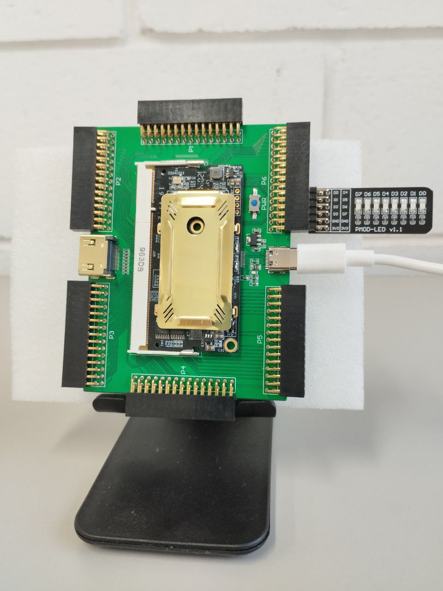
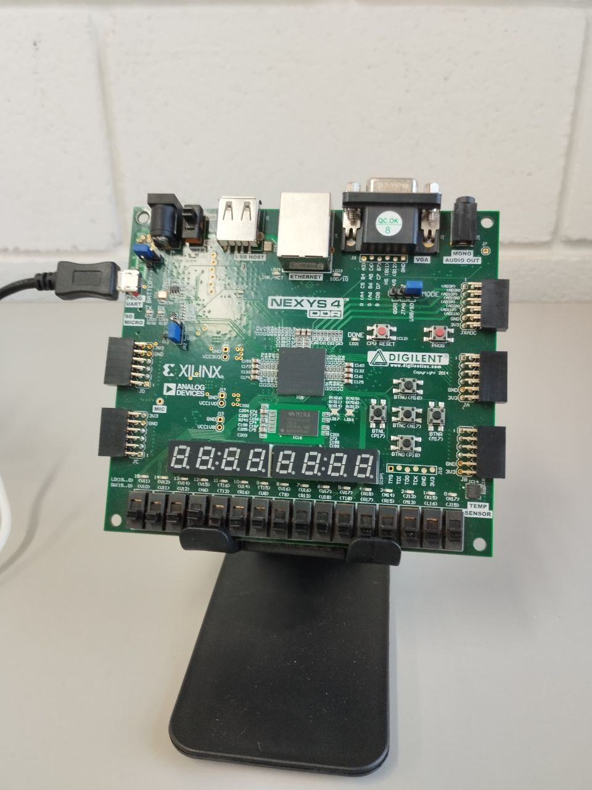

# Hardware infrastructure

## Processor CI Controller

Processor CI Controller is a hardware module that acts as a wrapper around the processor core, enabling control over it, monitoring the memory bus, and managing signals such as clock, reset, and halt.

[Github repository](https://github.com/LSC-Unicamp/riscv-isa-ci-controller)

## Project Modules

The controller is divided into various modules, each responsible for performing a specific function. Among the existing modules, the main ones are:

### Interpreter

The interpreter is responsible for receiving instructions sent by the test software and issuing commands to other modules. These commands can involve tasks such as reading and writing to memory, providing N clock cycles to the processor, etc.

### Communication Module

The communication module acts as the bridge between the host machine running the test software and the controller. It is responsible for implementing the protocol to be used, which could be UART, SPI, or PCIe.

### Clock Controller

The clock controller manages the clock signal provided to the processor. It has the capability to supply a specific number of pulses and/or divide the clock frequency.

### Memory Controller

The memory controller provides an access interface to the memory for both the controller and the processor, managing the priority with which each can interact with the memory.

## Currently supported FPGAs Boards

- Digilent Nexys 4 DDR
- Tang nano 20k
- Colorlight i9
- Digilent Arty A7 100T
- Xilinx VC709
- Cyclone 10 GX (In progress)

